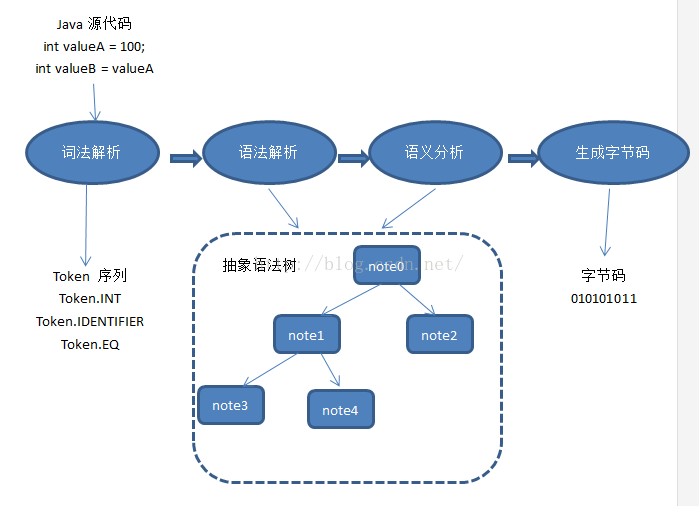

#Day:1  2021.5.13
今天看了编译原理1-15页
1.  一个编译器的结构：  
  
字符流->|词法分析器|->符号流->|语法分析|->语法树->|语义分析|->语法树->|中间代码生成器|->中间标识形式->|优化器|->中间表示形式->|代码生成器|->机器语言->|机器相关代码优化器|->机器语言
2.  编译器：源程序->目标程序  
解释器：源程序->直接输出
编译器快，解释器慢；编译器生成汇编或机器码难以调试，解释器错误诊断快
3.  源到源(source to source)：把一种高级语言翻译成另外一种高级语言  常用C语言作为目标语言，C语言好理解，执行快，兼容平台多
4.  一个语言处理系统的结构：
源程序->|预处理器|->预处理后的源程序->|编译器|->目标程序->|汇编器|->可重定位的机器代码->|链接器/加载器|+库文件->目标及其代码
链接器：连接库文件，外部系统文件，指针指向外部文件
加载器：加载所有文件并放入内存中
5.  机器代码：
```
目标代码:
LD R0, y      /* 把y的值加载到寄存器R0中*/
ADD R0, R0, z /* z加到R0上*/
ST x, R0      /* 把R0的值保存到x中*/
LD:加载指令
ST:保存指令
F:浮点数
ADD:加
MUL:乘
```
6.中间代码均为三地址代码，例：t1=id1*t2  
7.符号表记录变量名字和各种属性，属性有地址，类型，作用域等


